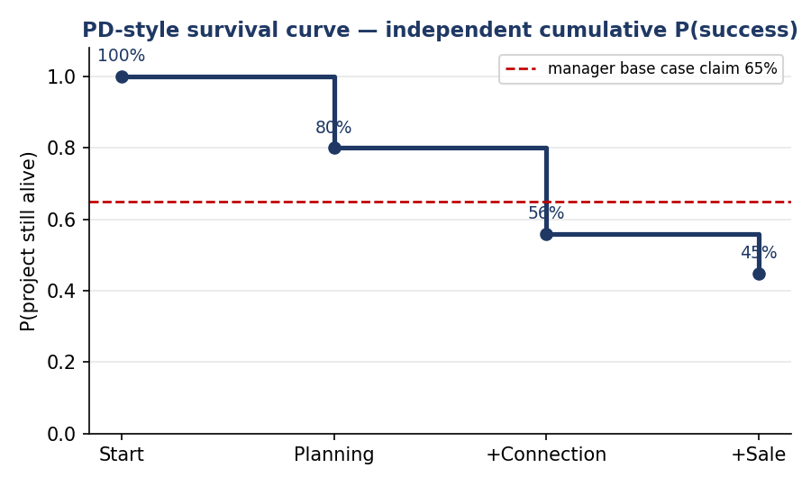
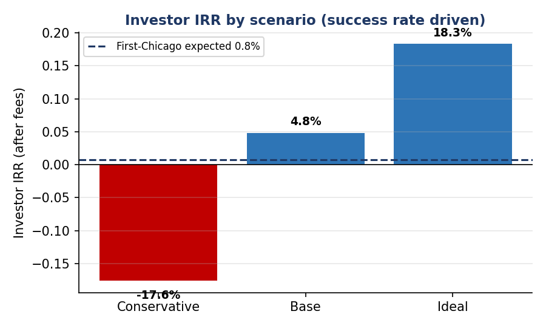

# Investment Committee Memo — Limited-Partner Commitment to a Distribution-Network Battery "Develop-and-Flip" Fund

| | |
|---|---|
| **Prepared by** | Investment analysis (credit-risk lens) |
| **Date** | June 2026 |
| **Stage** | Final Investment Committee |
| **Subject** | Independent assessment of a proposed limited-partner (LP) commitment to an illustrative develop-and-flip battery energy storage system (BESS) fund |
| **Deal type** | Fund commitment (limited partner) — infrastructure development |
| **Recommendation** | **CONDITIONAL — proceed to confirmatory due diligence; do NOT commit on the manager's figures alone** |

> **Status & standing.** This is an **educational portfolio artefact** and an **independent rebuild** of an (unnamed) fund manager's projections — **not investment advice**. Every figure attributed to the manager is a forward-looking **claim to verify**; our independent public-data findings sit alongside. The fund and pipeline are treated as **illustrative**. Wholesale-investor context — read the Information Memorandum; **capital is at risk.** All figures must be independently re-verified before any decision. See [Appendix A — Methods & sources](#appendix-a--methods--sources). *Acronyms (short forms) are spelled out on first use.*

> **▶ Open the interactive model online:** **[BESS Pipeline Valuation — live Excel workbook](https://1drv.ms/x/c/4486f9b7c333bd96/IQCSSeOA23OMS4zJdfkVXoeYASG_3AC1gFmTnfmMDz3hXkE?e=JalxsN)** — opens in Excel for the web and recalculates in your browser (no download). No-click alternatives: [model results preview](financial_models/MODEL_PREVIEW.md) · [one-page dashboard (PDF)](outputs/dashboard.pdf).

---

## 1. Recommendation (bottom line up front)

**Conditional. The opportunity is genuine, but on our independent rebuild it is materially less attractive than the manager presents, and the downside can impair capital. Do not commit on the projections.** Proceed to confirmatory due diligence and commit **only if** the manager evidences (1) a deep, contractually-progressing pool of buyers for ready-to-build (RTB) projects, (2) sub-5-megawatt (MW), per-state evidence that the headline **40% / 65% / 80%** are the development-approval (DA) gate only — and that the gates beyond approval (grid connection, sale) deliver the assumed true flip success, and (3) a survivable downside. Absent those, decline.

| Our independent view | The manager's claim |
|---|---|
| First-Chicago **expected investor internal rate of return (IRR) ≈ 0.8%** (multiple on invested capital, MOIC ~1.03×) | Headline scenario IRRs **10.7% / 19.4% / 23.8%** |
| **Conservative case loses capital** (IRR −17.6%, MOIC 0.68×) | Conservative case still positive (10.7%) |
| The headline **65% is the development-approval gate ONLY**; true whole-funnel flip success ≈ **36%** (0.65 × 0.70 × 0.80) | Base case presented as **65%** success |

*Basis — the full data-source-and-method table is in [Appendix A — Methods & sources](#appendix-a--methods--sources). In brief: the headline **40% / 65% / 80%** are the **development-approval gate alone**; true flip success is that gate × grid connection (70%) × sale (80%), so the Base case is 0.65 × 0.70 × 0.80 = **36.4%** and the independent public benchmark (approval 80%) is 0.80 × 0.70 × 0.80 = **44.8%**; the **IRRs** come from our model (risk-adjusted net present value + fund funnel + First-Chicago weighting); the manager's figures are stated claims to verify.*

**Recommendation in full: CONDITIONAL PROCEED (PASS-LEANING)** — proceed to confirmatory due diligence; commit **only if** every condition in [§10](#10-conditions--questions-for-the-founders) is met (else **Pass**). On the corrected gates the develop-and-flip is the **weakest risk-adjusted entry on the value chain** (~0.8% expected, with a −17.6% downside that impairs capital and zero carried interest earned at Base):

- **Buyer pool** — a deep, contractually-progressing ready-to-build buyer pool is evidenced.
- **Approval rate** — sub-5 MW, per-state development-approval evidence supports the 65% DA gate, and the grid-connection (70%) and sale (80%) gates are substantiated.
- **Survivable downside** — the fee-adjusted downside (−17.6%) does not impair more than the allocated sleeve.

**Stage choice:** the fund offers exposure mainly to *Stage 1 (develop-and-flip)* — which, on the corrected gates, is now the **weakest risk-adjusted entry** (≈0.8% expected IRR with a −17.6% downside that impairs capital). On a risk-adjusted basis, the *own-and-operate (contracted)* stage is a better fit for patient private capital — among the standalone entry points it is the only one that stays positive in its downside (the fully-integrated develop-build-operate path also does, but locks capital up ~18 years; see [§5](#5-business-model--value-chain-choice)).

**Single biggest risk:** *exit / buyer risk* (a flip with no buyer is a stranded asset), followed by *development / approval risk* and the fact that the **65% headline is the approval gate alone** — the gates beyond approval (connection, sale) are not free.

> **Returns attribution (the credibility line):** *Of the projected ~0.8% expected IRR (1.03× MOIC), essentially **all** of the thin gain is the development margin — selling ~35 ready-to-build projects for ~$31.5m gross against ~$26.7m of development spend (which also funds the ~61 projects that fail in the funnel) and ~$2.0m of fees; carried interest is **zero** because Base profit does not clear the 8% hurdle. **Zero** comes from merchant or operating upside, which passes to the buyer. The return depends on the development-approval rate, the grid-connection and sale gates, and the buyer pool — not on electricity prices.*

---

## 2. The deal & the thesis

The fund **develops ~5 MW distribution-connected (about 22-kilovolt, or 22 kV) batteries to shovel-ready (ready-to-build) status and sells them before construction**, across New South Wales (NSW), Victoria (VIC) and South Australia (SA), over a two-plus-one-year term. An investor would participate as a **limited partner** (LP — a passive investor who supplies capital but does not run the fund), committing up to **~$25 million**.

**The thesis in one line:** the fund captures the **development de-risking margin** — the uplift in value from a raw site to an approved, grid-connected project — in 2–3 years, with merchant-electricity-price risk passing to the buyer; it does **not** depend on long-run power prices. A small, capital-light fund can earn an attractive development margin by taking ~5 MW distribution batteries from greenfield (a bare site) to ready-to-build and selling them into a structurally short, policy-backed storage market. The model sidesteps the merchant-revenue risk that sinks battery operators (it sells before operation), and targets a niche — sub-5 MW distribution projects — that large developers overlook and that benefits from an Australian Energy Market Operator (AEMO) registration exemption. The thesis lives or dies on two things the manager cannot prove on paper:

- **Gate clearance** — that projects clear all three development gates (development approval × grid connection × sale) on time.
- **Buyer appetite** — that buyers will pay the assumed prices for early-stage ready-to-build projects.

**The reframe that decides which risks matter:** because the fund **never operates the asset**, the merchant-price volatility that usually sinks battery storage on a private-equity (PE) screen **passes to the buyer**. Diligence must therefore ignore the long-run electricity-price debate and focus on the fund's *actual* risks — **can projects be approved and grid-connected on time (the survival curve), and will buyers pay the assumed ready-to-build prices, in volume, on schedule (the exit)?**

| | A normal battery-storage operator | **This fund (develop-and-flip, ready-to-build)** |
|---|---|---|
| What it does | Builds, then trades electricity ~20 years | **Develops to ready-to-build, sells before construction** |
| Main risk | **Merchant-price volatility** | **Development/approval + exit/buyer risk** |
| Return driver | Cash yield + asset value | The **development margin**, captured in 2–3 years |

### Summary of findings

| # | Finding | Assessment |
|---|---|---|
| 1 | **Market is real, growing and policy-backed.** Coal retirement plus the renewables build-out create a structural firming gap; the growth stage is a *tailwind* for a develop-and-flip (more buyers), not the buy-and-hold "yellow flag." | ✅ Supportive |
| 2 | **The niche is plausibly defensible.** Large developers chase 100 MW-plus transmission projects, leaving ~5 MW distribution under-contested; sub-5 MW projects get an AEMO registration exemption → faster approval. | ⚠️ Verify the white space is durable |
| 3 | **Execution (survival) — the headline rate is the approval gate alone, not whole-funnel success.** The manager's **40% / 65% / 80%** are the development-approval (DA) gate only; a flip must also clear grid connection (≈70%) and a sale (≈80%). So **true Base-case flip success ≈ 36%** (0.65 × 0.70 × 0.80), and the independent public benchmark (approval 80%) is **≈ 45%** (0.80 × 0.70 × 0.80). The 65% headline **overstates** whole-funnel success. | 🔴 Key flag |
| 4 | **Exit market is deep but unproven for *this* product — and skewed to scale.** The deep-pocketed buyers (infrastructure funds, superannuation funds, the Clean Energy Finance Corporation/Energy Security Corporation, retailers) transact at **100 MW and above**; a single 5 MW asset is too small for them, so the natural buyers are a thinner pool (network companies, government programmes, aggregators). The "3 interested buyers" are **non-binding**. | 🔴 The decisive risk |
| 5 | **Economics are capital-light; the margin is the de-risking uplift.** Ready-to-build value is ~10–12% of built-asset value — confirming this is the development premium, not the build. Development cost ~$0.5m/project; the funnel widens as success falls (`started = target ÷ success`). | ✅ Coherent |
| 6 | **Independent returns are far below the manager's, with a real loss case.** Expected IRR ~0.8% versus the manager's ~17.7% claim; the conservative case impairs capital (IRR −17.6%, MOIC 0.68×). | 🔴 Decision-driving |

*Basis — each finding's data source, method and calculation are tabulated in [Appendix A — Methods & sources](#appendix-a--methods--sources). Headline methods: industry life-cycle model and Porter's Five Forces (Chartered Financial Analyst, or CFA, curriculum); probability-of-default / survival analysis (credit-risk practice) for the gate decomposition (approval × connection × sale); comparable-transactions evidence (energy trade press) for the buyer-size finding.*

Supporting visuals (independent model):

---

## 3. The company & what you're buying

*(Equity-specific. For now this section carries the fund / strategy overview; a later step adds pre-money / post-money valuation and the cap table.)*

A development fund has no operating history; what you are buying is a **strategy and a pipeline**, not an operating business. The fund "creates value" by de-risking projects, not by operating them.

| | |
|---|---|
| Strategy | Develop ~5 MW (about 22-kilovolt) distribution-connected batteries to ready-to-build, then sell the project companies before construction |
| How it earns | The development margin (ready-to-build sale price − development cost), captured across a portfolio of ~35 projects over 2–3 years |
| Geography | New South Wales, Victoria, South Australia (eastern National Electricity Market) |
| Fund size / term | ~$25 million committed; two-plus-one-year term; wholesale investors only |
| Fees | 2% entry, 2% per year management, 20% carried interest over an 8% preferred return |
| What is *out* of scope | Construction (project-financed by the buyer) and 15–20 years of operation — the fund is gone before the battery switches on |

### Fund economics & pipeline (the funnel)

A development fund's economics are the **funnel** — how many projects must be started to deliver the target, and the margin on each. Base-case figures (independent rebuild):

| Funnel (Base case) | Value |
|---|---|
| Development-approval (DA) gate | 65% *(manager headline — the approval gate ONLY, not whole-funnel success)* |
| Grid-connection gate | 70% |
| Sale gate | 80% |
| **Whole-funnel flip success** (DA × grid × sale) | **36.4%** *(= 0.65 × 0.70 × 0.80; independent benchmark at DA 80% = 0.80 × 0.70 × 0.80 = 44.8%)* |
| Projects delivered & sold (target) | 35 |
| Projects started (= target ÷ flip success) | ~96 |
| Total development cost (delivered + partial on the ~61 dropouts) | $26.7 million |
| Management + entry fees | $2.0 million |
| **Invested capital (limited-partner, called)** | **$28.7 million** |
| Gross proceeds (35 sales) | $31.5 million |
| Carried interest to manager | $0.00 million *(profit below the 8% hurdle — no carry earned)* |
| **Distributions to limited partners** | **$31.5 million** |

*Earnings-quality note: there are no operating earnings to scrutinise — the "quality" question is whether the **ready-to-build sale prices and the gate success rates** are real. Both are manager claims requiring independent comparable-transaction and per-state approval evidence. Note the 65% headline is the **development-approval gate alone**; the whole-funnel flip success (after the grid-connection and sale gates) is ~36%.*

---

## 4. Industry & market

The fund does not build batteries and sell electricity. It buys small sites, takes them through planning approval and grid connection until they are "shovel-ready" — the industry term is **ready-to-build (RTB)** — and then sells the approved projects to someone else who builds them. Each project is a standalone battery of about **5 megawatts (MW)** connected to the local distribution network (the everyday poles-and-wires, not the high-voltage transmission grid), and the projects are spread across New South Wales, Victoria and South Australia. The whole cycle is meant to take two to three years.

This is the most important thing to understand, because it changes which risks matter. A normal battery owner lives or dies on the volatile price of electricity over fifteen or twenty years. This fund is gone before the battery ever switches on, so **that price risk belongs to the buyer, not to the fund.** Its two real questions are therefore simpler and sharper: **can the fund get its projects approved and connected on time, and will there be buyers willing to pay the assumed prices when it comes time to sell?**

### What the stations are for, who uses them, and how big the market is

**What a 5 MW battery does.** A 5 MW distribution-connected battery is, in practice, a **community / neighbourhood battery** — these connect to the local network and are typically up to 5 MW. Its jobs, and who benefits, are:

| What it does | Who uses / benefits |
|---|---|
| Stores the midday rooftop-solar surplus and releases it into the evening peak | Households & local community |
| Supports the local network (voltage, reliability) and defers poles-and-wires upgrades | Distribution network service provider (DNSP) — the local network company |
| Buys power cheap / sells dear (energy arbitrage) and provides fast frequency control ancillary services (FCAS) | The wholesale market, via the Australian Energy Market Operator (AEMO) |
| Firms local solar and wind | Electricity retailers & community |

*Basis — Data source: distribution network service provider community-battery programmes (Ausgrid, Endeavour), Energy Networks Australia, the Australian Energy Regulator (AER), and the Australian Renewable Energy Agency (ARENA); stored in [`data/processed/end_use.csv`](data/processed/end_use.csv). Method: use-case mapping (each service matched to its user). Calculation: none — compiled from public programme descriptions.*

**Who owns them today — a telling fact.** Almost all existing community/distribution batteries are **owned and operated by the network companies (distribution network service providers)** or funded by **government programmes** — the federal $200 million Community Batteries programme, Victoria's 100 Neighbourhood Batteries programme, Power Melbourne, and network roll-outs (Ausgrid has commissioned a 5 MW community battery). Most still need a discounted network tariff to be financially viable.

**Is the market big?** Storage demand is large and growing fast — but the 5 MW niche is a *distinct, smaller slice* of it. Using the Australian Energy Market Operator's Integrated System Plan 2026 (its central "Step Change" scenario):

| Segment | 2026 | 2030 | 2050 |
|---|---|---|---|
| Small-scale / distributed (home + community batteries) | 5 gigawatts (GW) | 12 GW | 35 GW |
| Grid-scale (developer-built, ~100 MW and above) | ~45 GW already in the connection queue | — | ~40 GW of need |

So demand is real and structural — **but the capital and the deals sit overwhelmingly at the grid-scale (100 MW and above) end**, which leads straight to the buyer question below.

*Basis — Data source: Australian Energy Market Operator Integrated System Plan 2026, reported via pv magazine Australia, RenewEconomy and Energy-Storage.news; stored in [`data/processed/market_demand.csv`](data/processed/market_demand.csv). Method: reported public figures (market sizing). Calculation: read directly from the published Integrated System Plan trajectory; re-verify against the source document.*

### Is the market real and growing?

Yes, and for structural rather than fashionable reasons. Australia is closing its ageing coal power stations while adding large amounts of solar and wind. Because solar and wind are intermittent, the grid increasingly needs storage that can deliver power on demand, and batteries are the cheapest and fastest way to provide it for the short durations that matter most today. Governments have backed this with firm targets and subsidy schemes, which turns a physical need into real, financeable demand. Importantly, the amount of storage actually funded still lags well behind the targets, so there is genuine room for new projects.

For a developer who simply wants to build approved projects and sell them, this fast growth is helpful — rising demand means more potential buyers. (The same instability would worry someone planning to own and operate for fifteen years, but that is not this fund.) The one caveat is that the demand rests on government policy, and a two-to-three-year fund is exposed if those policies soften part-way through.

*Basis — Data source: Australian Energy Market Operator Integrated System Plan 2026; Clean Energy Finance Corporation and state-government renewable targets. Method: industry life-cycle model (Chartered Financial Analyst, or CFA, curriculum) — placing the industry on the embryonic → growth → mature → decline curve. Calculation: a qualitative classification ("growth") read from the storage-capacity growth trajectory.*

### Is the fund's niche defensible?

Plausibly, but it needs checking. The fund's edge is that it deliberately works on **small ~5 MW projects** that the big developers overlook in favour of large 100 MW-plus transmission projects, which leaves the small end of the market less crowded. There is also a regulatory advantage: projects under 5 MW are exempt from a layer of Australian Energy Market Operator registration, which should make approval faster and cheaper. If that exemption holds, and if the fund genuinely has the site access, grid know-how and network-operator relationships it claims, the niche could be defensible. None of that should be taken on trust — it is exactly what diligence must confirm.

*Basis — Data source: Australian Energy Regulator / Australian Energy Market Operator market rules (the sub-5 MW registration exemption); trade-press commentary on the small-distribution segment. Method: Porter's Five Forces (CFA curriculum / Michael Porter), applied to the market for development rights — specifically the "threat of new entrants" and "rivalry" forces. Calculation: none — a qualitative competitive assessment.*

### The decisive risk: will there be buyers?

This is the heart of the matter. Because the fund's entire return comes from selling, the strength of the buyer market decides everything. The good news is that the pool of buyers for Australian battery assets is real and well-funded:

- **Independent power producers** — building out their own portfolios.
- **Infrastructure funds** — for example Palisade/Intera, Copenhagen Infrastructure Partners, Quinbrook.
- **Superannuation funds** — for example Aware Super, the Health Employees Superannuation Trust Australia (HESTA).
- **Government green-investment bodies** — the Clean Energy Finance Corporation (CEFC) and the Energy Security Corporation (ESC).
- **Large electricity retailers** — for example Origin, AGL, EnergyAustralia.

Two cautions dominate, though. First, the fund's "three interested buyers" are **not contractually committed** — interest is not a purchase. Second, and more important, the wider market increasingly pays up for projects that are *further along*, already contracted or construction-ready, whereas this fund sells at the *earlier* ready-to-build stage. So the fund must show either that demand for ready-to-build projects specifically is genuinely deep, or that its projects are de-risked enough to command the assumed prices.

**Do buyers actually want 5 MW assets — or do they prefer 100 MW and above?** This is the sharpest question, and the recent deal record answers it plainly: **the deep-pocketed buyers transact at scale, not at 5 MW.**

| Recent deal / project | Size | Buyer |
|---|---|---|
| Summerfield (South Australia) | 240 MW / 960 megawatt-hours (MWh) | Palisade (with the Clean Energy Finance Corporation, Aware Super, the Health Employees Superannuation Trust Australia) |
| Supernode Stage 1 (Queensland) | 260 MW / 619 MWh | Origin (12-year tolling contract) |
| Energy Security Corporation platform (New South Wales) | 200 MW | Energy Security Corporation |
| Ebor (New South Wales) | 100 MW / 870 MWh | New South Wales Long-Term Energy Service Agreement (LTESA) tender |
| **A community / distribution battery** | **~5 MW** | **Distribution network service provider / government programme / aggregator** |

Infrastructure and superannuation funds say it out loud — Aware Super and the Health Employees Superannuation Trust Australia described the 240 MW Summerfield deal as exactly the **"large scale"** infrastructure they want. A single 5 MW project is simply **too small** for them: the due-diligence and management effort is much the same as for a 200 MW asset, so they favour size. The natural buyers of *individual* 5 MW batteries are a **thinner, more specialised, often grant-dependent pool** — distribution network service providers, government programmes and aggregators.

**The mitigation — and the catch.** The way a small-project developer reaches the big buyers is to **bundle many projects into a portfolio.** The fund's ~35 projects (~175 MW combined) could, aggregated, reach the scale an infrastructure fund wants, and the market increasingly supports aggregation. But that changes the exit: the fund would likely have to **sell the whole portfolio as a single platform** — one large, all-or-nothing transaction — rather than sell 5 MW projects one at a time. That **concentrates** the exit risk rather than removing it, and it only works if the portfolio is deliberately built and marketed as one block.

*Basis — Data source: energy trade press (Energy-Storage.news, pv magazine Australia, power-technology, Quinbrook, Energy Security Corporation); stored in [`data/processed/deal_sizes.csv`](data/processed/deal_sizes.csv). Method: comparable-transactions analysis (CFA relative-valuation; mergers-and-acquisitions practice) — recent deals listed by size and buyer. Calculation: none — observed deal sizes; the chart simply plots reported megawatts per deal.*

### Can they execute? The success-rate question

The other make-or-break is whether projects actually clear their hurdles on schedule. The crucial point is what the manager's headline **40% / 65% / 80%** figures actually measure: they are the **development-approval (DA) gate alone** — the chance a project wins planning approval — *not* the whole-funnel success rate. A develop-and-flip project must clear **three separate gates**: development approval, *then* grid connection, *then* a sale. The true flip success is the **product** of all three:

| Step | Chance of passing |
|---|---|
| Development approval (DA gate — the manager's headline) | 40% / 65% / 80% |
| Grid connection | ~70% |
| Reach a sale | ~80% |
| **True flip success — Base case (multiplied)** | **0.65 × 0.70 × 0.80 = 0.364 (~36%)** |
| **True flip success — independent benchmark (DA 80%)** | **0.80 × 0.70 × 0.80 = 0.448 (~45%)** |

In other words, the manager's **65% base case is the approval gate only** — it **overstates** whole-funnel success. Once grid connection and the sale are layered on, the true Base-case flip success is about **36%** (0.65 × 0.70 × 0.80), and even the manager's *ideal* 80% approval gate maps to a ~45% whole-funnel flip. An independent public benchmark (80% approval) gives the same ~45% (0.80 × 0.70 × 0.80 = 0.448). The earlier "optimism gap" framing was wrong: the gap is not between a 65% claim and a 45% reality, but the simpler fact that the 65% headline measures **one gate, not the whole funnel**. There is a fair counter-argument — the sub-5 MW exemption and the simplicity of small projects might genuinely lift the approval gate above the benchmark — so the right response is not to dismiss the fund, but to **ask the manager for project-by-project, state-by-state evidence** of its approval and connection record. Timing is the other enemy: approvals routinely take many months, and if they slip by six to twelve months the returns fall sharply.

*Basis — Data source: public planning-approval and grid-connection data (Australian Energy Market Operator connection statistics; New South Wales / Victoria / South Australia planning portals); stored in [`data/processed/gate_stats.csv`](data/processed/gate_stats.csv). Method: a probability-of-default (PD) / survival curve — the same multi-period idea credit teams use under the Basel framework and International Financial Reporting Standard 9 (IFRS 9). Calculation: the manager's headline (40/65/80%) is the development-approval gate only; true flip success = approval × connection × sale. Base case = 0.65 × 0.70 × 0.80 = 0.364 (~36%); independent benchmark = 0.80 × 0.70 × 0.80 = 0.448 (~45%).*

### What this means for the returns

(The full figures are in [§6 Valuation & your stake](#6-valuation--your-stake) and [§7 Returns to your shares](#7-returns-to-your-shares); this is the bottom line.) When we rebuild the fund's returns independently — applying the **true three-gate flip success** (development approval × grid connection × sale) rather than the approval gate alone — the expected investor return after fees comes out at roughly **1%** (internal rate of return ≈ 0.8%, multiple on invested capital ≈ 1.03×), far below what the manager's headline approval rates suggest. The reason is the corrected gates: the develop-and-flip clears the whole funnel only ~36% of the time in the Base case, so far more projects must be started and far more capital is consumed on failures. More tellingly, the downside is severe: in the conservative case the fund returns **less than the money invested** (multiple on invested capital ≈ 0.68×; internal rate of return ≈ −17.6%) — a genuine impairment of capital. So on the corrected gates the develop-and-flip is no longer attractive; it is the **weakest risk-adjusted entry**, with real downside risk to capital.

*Basis — Data source: the model's inputs in [`config/assumptions.yaml`](config/assumptions.yaml) plus the live risk-free rate from the Reserve Bank of Australia (RBA). Method: risk-adjusted net present value (rNPV) per project; a fund "funnel" (projects started = target ÷ true flip success); fees and carried interest; then probability-weighting the scenarios with the First-Chicago method (CFA scenario analysis + private-equity/venture-capital practice). Calculation: each scenario's after-fee internal rate of return (IRR), weighted 30% / 50% / 20%, gives ≈ 0.8% (multiple on invested capital, or MOIC, ≈ 1.03×); the conservative case returns a multiple on invested capital of 0.68× — below 1.0× — i.e. a capital loss (IRR −17.6%).*

---

## 5. Business model & value-chain choice

A develop-and-flip fund "creates value" by de-risking projects, not by operating them. The committee should also weigh **where on the value chain to invest**, because the same projects can be entered at several points with very different risk-return. The first three are *standalone* entry points (you buy in at that stage's market price); the fourth is the **integrated** path, where you carry one project through all three. Each is a genuinely different investment on a risk ladder — **develop (highest risk) → build → operate (lowest, if contracted)** — compared here as risk-adjusted, levered equity returns on the same ~5 MW asset:

| Stage | Hold | Expected IRR | Expected MOIC | Downside IRR | Main risk / character |
|---|---|---|---|---|---|
| 1 — Develop & flip (sell ready-to-build) | ~3 years | **0.8%** | 1.03× | **−17.6%** | approvals on time + a buyer pays (can lose capital); weakest risk-adjusted entry |
| 2 — Build & sell | ~1.5 years | **25.9%** | 1.41× | **−18.2%** | construction cost/delay + thin build margin; highest expected, most fragile |
| 3 — Own & operate (contracted) | ~15 years | **8.1%** | 2.41× | **+4.4%** | merchant price (steady if contracted); only standalone stage positive in its downside |
| 4 — Integrated (develop→build→operate, keep) | ~18 years | **12.2%** | 4.41× | **+8.3%** | all risks stacked (development + construction + merchant), but NO buyer/exit risk |

**Recommendation by stage (for patient private capital):**

- **Stage 3 — own & operate (contracted): the natural core.** The only *standalone* stage positive in its downside; steady, long-dated yield; plays to the credit-risk edge (assessing the offtake counterparty is *serviceability analysis* — judging whether the tolling/offtake buyer will actually pay is the same as judging whether a borrower can service a loan). Avoid merchant-only operating.
- **Stage 1 — develop & flip: now the weakest entry, at most a small satellite.** On the corrected gates it earns only ~0.8% expected IRR with a −17.6% downside that impairs capital — the worst risk-adjusted return of the four. Only on the conditions in [§10](#10-conditions--questions-for-the-founders), and even then sized small.
- **Stage 2 — build & sell: skip as a standalone** — the highest *expected* return but the most fragile (a thin, merchant-dependent build margin; a heavy downside) and it needs construction expertise.
- **Stage 4 — integrated (develop → build → operate): a different business model.** Captures the whole value chain and removes exit risk; because you build at cost, operating returns are strong with a positive downside *if it reaches operation*. But it is the longest lock-up (~18 years), stacks all the risks, and only ~50% of starts reach operation. For a patient owner-operator, not a passive limited partner.
- **Alignment trap:** the manager keeps the best projects to operate and sells the rest — ask to co-invest in the ones they keep.

> **The headline 40% / 65% / 80% are the development-approval (DA) gate only — and only Stage 1 bears all three gates.** A develop-and-flip (Stage 1) project must clear **development approval × grid connection (70%) × sale (80%)**, so true Base flip success is 0.65 × 0.70 × 0.80 ≈ **36%** (Ideal, approval 80%, ≈ 45%) — the 65% is *not* whole-funnel success. Stage 2 and Stage 3 investors **buy past development** (a project that has already cleared it, at market price), so they bear construction-completion (~90%) and merchant-price risk instead. The integrated **Stage 4 also runs development, but has no sale gate** — it bears approval × connection × construction, i.e. ~56% development survival × ~90% construction, because it keeps the asset rather than selling it. Each stage is priced at its own entry point, so the comparison stays like-for-like and the manager's approval gate drives only the Stage 1 number.

*Basis — **Data source:** [`config/assumptions.yaml`](config/assumptions.yaml) (development cost, construction cost, operating revenue, debt terms) + the RBA risk-free rate. **Method:** levered equity IRR per stage — Stage 1 is the fund funnel; Stage 2 is a build-and-sell model risk-adjusted by completion probability; Stage 3 is a levered operating discounted-cash-flow (DCF) with low/base/high merchant-price scenarios. **Calculation:** full workings in [`financial_models/STAGE_COMPARISON.md`](financial_models/STAGE_COMPARISON.md). Figures are illustrative — the Stage 2 result is highly sensitive to the build margin.*

---

## 6. Valuation & your stake

- **What we pay:** limited partners fund the development spend and fees (~$28.7 million called against the ~$25 million committed — the corrected funnel requires ~96 starts to deliver 35 sales, so the called capital exceeds the headline commitment and is itself a gating concern). There is no entry "multiple" — the relevant price is what buyers pay for a ready-to-build project versus the cost to create it.
- **The value ladder:** a ready-to-build project sells for roughly **$0.5–1.1 million per 5 MW** (manager claim — New South Wales $0.9–1.1m, Victoria $0.8–1.0m, South Australia $0.5–0.7m), which is only **~10–12% of the ~$8–10 million built-asset value**. That confirms this is the early-stage development premium, not the construction value — and it needs independent comparables.
- **Structure & terms:** 2% entry / 2% per year management / 20% carried interest over an 8% preferred return; two-plus-one-year term, no early redemption. Sources & Uses: [Appendix C, Exhibit 1](#exhibit-1--sources--uses-base-case-limited-partner-capital).
- **Discount rate (for asset cross-checks):** 18.8% = Reserve Bank of Australia 10-year Commonwealth Government Securities (CGS) yield 4.8% + 14.0% development risk premium (build-up method).

**Key assumptions** *(manager claims unless noted):*

| Assumption | Value |
|---|---|
| Committed capital | ~$25m |
| Projects delivered / sold | 35 |
| Development cost | ~$0.5m per project (+ partial spend on dropouts) |
| Fund term | 2 + 1 years |
| Entry fee | 2% of committed capital |
| Management fee | 2% per year |
| Carried interest / hurdle | 20% carry over an 8% preferred return |
| Discount rate *(asset cross-checks)* | 18.8% = RBA 10-year Commonwealth Government Securities (CGS) yield 4.8% + 14.0% development risk premium |

**Ready-to-build sale price by state** *(manager claim — needs independent comparables):*

| State | Price per 5 MW project |
|---|---|
| New South Wales | $0.9m – $1.1m |
| Victoria | $0.8m – $1.0m |
| South Australia | $0.5m – $0.7m |

*Basis — the discount rate uses the **build-up method** (required return = risk-free rate + risk premium): the risk-free leg is the live RBA 10-year Commonwealth Government Securities yield (`data/processed/rates.csv`); the 14.0% premium is analyst judgement. All other rows are the manager's projections (claims to verify); the ready-to-build prices need independent comparable-transaction evidence.*

---

## 7. Returns to your shares

Modelled bottom-up from public data (survival curve → fund funnel → fees and carried interest → investor IRR and MOIC), with scenarios driven by **flip success (= development approval × grid connection × sale) — the master driver, which the scenarios move via the development-approval (DA) gate** — and weighted via the **First-Chicago** method.

| Scenario | DA gate | Flip success* | Projects started† | Investor MOIC (net) | Investor IRR (net) |
|---|---|---|---|---|---|
| Conservative | 40% | 22.4% | ~156 | **0.68×** | **−17.6%** |
| Base | 65% | 36.4% | ~96 | **1.10×** | **+4.8%** |
| Ideal | 80% | 44.8% | ~78 | **1.40×** | **+18.3%** |
| **First-Chicago expected** (30/50/20 weighting) | — | — | — | **~1.03×** | **~0.8%** |

\*Flip success = DA gate × grid connection (70%) × sale (80%): e.g. Base 0.65 × 0.70 × 0.80 = **36.4%**. The headline 40% / 65% / 80% are the **approval gate alone**, not whole-funnel success.

†To deliver the ~35-project target, the starting pipeline must widen as flip success falls — which is why a lower success rate also raises total development cost.

The same scenarios viewed by invested capital and gross proceeds:

| Metric (net to limited partner) | Conservative (DA 40% → flip 22.4%) | Base (DA 65% → flip 36.4%) | Ideal (DA 80% → flip 44.8%) |
|---|---|---|---|
| Investor IRR | **−17.6%** | **4.8%** | **18.3%** |
| Investor MOIC | 0.68× | 1.10× | 1.40× |
| Invested capital ($m) | 39.5 | 28.7 | 25.2 |
| Gross proceeds ($m) | 26.8 | 31.5 | 36.2 |

*The scenario labels are the manager's **development-approval (DA) headline**; the bracketed flip success is the corrected whole-funnel rate (DA × grid connection 70% × sale 80%).*

**Probability-weighted (First-Chicago, 30/50/20): expected IRR ≈ 0.8%, MOIC ≈ 1.03×.** Scenario IRR range −17.6% … +18.3%. For comparison, the manager's own scenarios imply a far higher ~17.7% — the gap is the funnel correction: the manager's headline is the approval gate alone, while the corrected number applies all three gates.

*Attribution (ties to [Appendix C, Exhibit 3](#exhibit-3--return-bridge-base-case-m-net-to-limited-partners)):* the entire thin gain is the development margin — gross proceeds of $31.5 million less ~$26.7 million development cost and ~$2.0 million of fees, leaving ~$2.8 million of net profit to limited partners in the Base case; **carried interest is zero because Base profit does not clear the 8% hurdle**. None of the return relies on merchant or operating upside. The return is therefore most sensitive to the **development-approval rate** and the **ready-to-build price** ([Appendix C, Exhibit 2](#exhibit-2--returns-sensitivity-investor-irr-across-development-approval-da-gate--ready-to-build-price)): at the Base DA rate the deal is only marginally positive, and a 15–30% price fall pushes it firmly negative.

**Key assumptions** *(manager claims unless noted):* the full list is in [§6 Valuation & your stake](#6-valuation--your-stake).

*Basis — **Data source:** model inputs in [`config/assumptions.yaml`](config/assumptions.yaml) plus the live risk-free rate from the Reserve Bank of Australia (RBA). **Method:** risk-adjusted net present value (rNPV) per project; a fund funnel; fees and carried interest; First-Chicago scenario weighting (CFA scenario analysis + PE/venture-capital practice). **Calculation:** each scenario's after-fee IRR weighted 30% / 50% / 20% → ≈ 0.8%; the conservative case's MOIC of 0.68× (below 1.0×) is a capital loss.*

> **Read-through:** our rebuild is deliberately more conservative than the manager's (full development spend across the funnel; independent costs/prices; and — decisively — treating the 65% as the **approval gate alone**, so true Base flip success is 0.65 × 0.70 × 0.80 ≈ 36%, not 65%). The result — **expected return only marginally positive (≈0.8%), well below the manager's, and a downside that returns far less than capital** — is the credit-style scepticism this decision requires.

---

## 8. Risks & protections

| Risk | Severity | Why it matters here / mitigant required |
|---|---|---|
| **Exit / buyer risk** | **High** | The decisive risk. Buyers are non-binding, transact at 100 MW+ (not 5 MW), and the market leans to *contracted* assets, not raw ready-to-build. A flip with no buyer is stranded capital. *Require ≥3–4 credible, contractually-progressing buyers and independent price comparables; require the fund to aggregate projects into a saleable portfolio.* |
| **Development / approval risk** | **High** | Planning + grid connection on time across three states; the master driver of returns via flip success (approval × connection × sale). *Require sub-5 MW, per-state development-approval and grid-connection track record; stress a 6–12-month slip.* |
| **65% is the approval gate alone (whole-funnel overstatement)** | **High** | The manager's 65% is the development-approval gate only, not whole-funnel success; true Base flip success ≈ 36% (0.65 × 0.70 × 0.80). *Re-underwrite on whole-funnel flip success (DA × grid 70% × sale 80%), not the approval-gate headline; require evidence for each of the three gates.* |
| **Policy dependency** | **Medium–High** | Buyer appetite rests on net-zero / state schemes and the sub-5 MW exemption; a mid-window change hits all projects at once. *Diversify across three states; treat the sub-5 MW exemption as a verify-and-monitor item.* |
| **Concentration** | **Medium** | ~35 projects, one strategy, three states — correlated to a single policy/rule change. *Size the commitment as a satellite, not a core holding.* |
| **Fees & liquidity** | **Medium** | 2%/2%/20%-over-8% is a meaningful gross-to-net drag; two-plus-one-year lock-up with no early redemption. *Confirm net-of-all-fees IRR and the gross behind it; accept illiquidity only for the satellite sleeve.* |
| **Alignment** | **Medium** | The manager plans to keep the "best" 5–10 projects to operate — confirm how "best" is selected so the flip pool isn't left the weaker assets. *Selection rule + co-invest rights.* |

> Note what is **not** the main risk: **merchant-price volatility**, which passes to the buyer (the reframe in [§2](#2-the-deal--the-thesis)).

*Stress case:* at the Base development-approval rate the flip is **only marginally positive** (4.8% / 1.10×), and at the conservative 40% approval rate (flip ~22%) the fund returns **far less than invested capital** (−17.6% / 0.68×). With ready-to-build prices 20–30% lower on top, the loss deepens further. Survivable only because the commitment is sized as a small, risk-tolerant allocation — not because the downside is mild.

---

## 9. Exit — how you get your money back

Capital returns as the fund **sells ready-to-build projects** over the two-to-three-year window. The buyer pool spans:

- **Infrastructure funds** and **superannuation funds**.
- **Independent power producers** building out their own portfolios.
- **Government green-capital bodies** — the Clean Energy Finance Corporation and the Energy Security Corporation.
- **Electricity retailers** seeking firming capacity.

**The exit is the binding constraint.** Because individual 5 MW assets are sub-scale for the large buyers, the realistic exit is **selling an aggregated ~175 MW portfolio as a single platform** — one large, all-or-nothing transaction — rather than 35 separate flips. That concentrates the exit and only works if the portfolio is deliberately built and marketed as one block. The committee should treat a demonstrated, contractually-progressing exit path as the gating condition.

---

## 10. Conditions & questions for the founders

**Recommendation: CONDITIONAL PROCEED (PASS-LEANING)** (to confirmatory due diligence; commit only as a small, risk-tolerant satellite allocation, and only if every condition below is met). On the corrected gates the develop-and-flip is the **weakest risk-adjusted entry on the value chain** — expected IRR ~0.8% (1.03× MOIC) barely clears zero, the conservative downside (−17.6% / 0.68×) impairs capital, and **carry is zero at Base because profit does not clear the 8% hurdle**. Absent strong evidence on the conditions, the default is **Pass**.

**Commit only if all of the following are evidenced (the bar is explicit — any one unmet ⇒ Pass):**

1. **Exit depth & pricing** — at least 3–4 credible, *contractually-progressing* ready-to-build buyers and **independent comparables** supporting the assumed price per project (not merely "interested"); a credible portfolio-aggregation exit (a **deep contracted buyer pool**).
2. **Success rate / gate evidence** — sub-5 MW, per-state evidence that the 65% is genuinely the development-approval gate, plus grid-connection and sale data supporting the ~70% and ~80% gates beyond it (true Base flip success ≈ 36%).
3. **Survivable downside** — the fee-adjusted conservative case (−17.6% / 0.68×) stressed further (ready-to-build prices down 20–30%, flip success near ~22%) without impairing more than the allocated sleeve.
4. **Alignment** — a transparent rule for selecting the "keep-best 5–10" projects, plus co-investment rights in retained projects.

**Approval sought:** authority to conduct confirmatory due diligence and, if every condition is met, to commit up to ~$25 million as a satellite allocation — noting building, owning and integrating score better per unit of downside risk.

**Questions for the manager:**

- Historical/expected **approval, connection and sale** success **by state**, specifically for **sub-5 MW** — with evidence that 65% is the approval gate and not whole-funnel success?
- Of the "3 interested buyers," what is **contractual** (signed options/memoranda of understanding, price/terms)?
- The **bottom-up ~$0.5m/project** development-cost build-up?
- **Independent comparables** behind the ready-to-build prices ($0.5–1.1m/project)?
- The **net-of-all-fees** IRR and the **gross** IRR behind it?
- What happens to timeline and IRR if approvals slip **6–12 months**?
- How are the projects the manager plans to **keep and operate (five to ten of the best)** chosen, since that affects what is left for investors?
- The genuine downside — **can limited partners lose capital, and in which scenario?**

---

## Appendix A — Methods & sources

**Why this exists (portfolio note).** This repository demonstrates two interview-tested skills:

1. **Data engineering** — a configuration-driven, reproducible Python pipeline over free public Australian data (Reserve Bank of Australia; the Commonwealth Scientific and Industrial Research Organisation's GenCost report; the Australian Energy Market Operator; New South Wales / Victoria / South Australia planning portals; energy trade press), with verify-then-fallback and full source logging.
2. **Advanced financial modelling** — a formula-driven, institutional-standard Excel model that values the develop-and-flip pipeline and the **investor (limited-partner) return**, via a probability-of-default-style survival curve, per-project risk-adjusted net present value, a fund funnel with fees and carried interest, and First-Chicago scenario weighting.

The headline story: *applying credit-risk (probability-of-default / survival) discipline and institutional Excel standards to an infrastructure-development fund — independently rebuilding a manager's claims on fully public data.*

**Methodology (what the model computes).**

1. **Probability-of-default-style survival curve** — `flip success = p(development approval) × p(connection) × p(sale)` from public data. The headline 40% / 65% / 80% are the **development-approval gate only**; the scenarios move that gate, and true flip success is the product (Base 0.65 × 0.70 × 0.80 ≈ 36%; independent benchmark, approval 80%, ≈ 45%), so the 65% headline overstates whole-funnel success.
2. **Per-project risk-adjusted net present value** — `ready-to-build sale − development cost = margin`, `× flip success` (= approval × connection × sale), discounted (development cost only — the buyer funds construction).
3. **Fund funnel → investor return** — `started = target ÷ success`; development cost (full on delivered + partial on dropouts); fees (entry + management + carried interest over the hurdle); **investor IRR & MOIC** (closed-form over the effective hold).
4. **Scenario / First-Chicago** — Conservative / Base / Ideal, probability-weighted to an expected return.
5. **Cross-checks** — dollar-per-MW benchmark, venture-capital method, and ready-to-build-as-%-of-built (~10–12%).
6. **Three-stage value-chain comparison** (`src/stage_analysis.py`) — Stage 1 develop-and-flip, Stage 2 build-and-sell (levered, with completion risk), Stage 3 own-and-operate (levered operating discounted-cash-flow with merchant scenarios), each as a risk-adjusted equity return → see [§5](#5-business-model--value-chain-choice).

The Python `valuation_engine.py` reproduces the Excel workbook **cell-for-cell** (Base investor IRR 4.8% in both); a `formulas`-library recalculation confirms the model's master check reads **OK** with zero error cells.

**Methods & theory (CFA curriculum + real-world practice).** Every result uses a recognised technique, not a bespoke one — in plain terms:

| Technique | What it does (plain English) | Where it comes from |
|---|---|---|
| Industry life-cycle · Porter's Five Forces · a Political-Economic-Social-Technological-Legal-Environmental (PESTLE) scan | Judge the industry's growth stage, competition and outside forces | CFA — industry analysis |
| Private-equity / venture-capital deal screen | Score the deal like an infrastructure/PE investor: exit path, barriers to entry, capital intensity | Real-world PE practice |
| Discount rate = risk-free rate + risk premium | Required return = a safe government-bond yield + extra for development risk | CFA — required return / cost of capital |
| Risk-adjusted net present value | Future cash flows × the chance they happen, discounted to today's money | CFA (time value of money, expected value); used in pharmaceutical & infrastructure development |
| Probability-of-default-style survival curve | Multiply the chance of clearing each gate to get the overall success rate | Credit-risk practice (Basel framework, International Financial Reporting Standard 9) |
| Comparable transactions (dollar-per-MW) | Price the asset off what similar projects actually sold for | CFA — relative valuation; mergers-and-acquisitions practice |
| Scenario analysis + First-Chicago method | Run Conservative/Base/Ideal and weight them by likelihood into one expected number | CFA (scenario analysis); PE/venture-capital practice |
| Venture-capital method | Work back from the exit value at a target return to today's value | Real-world venture-capital practice |
| IRR, MOIC, fee & carried-interest waterfall | Investor return after fees and 20%-carry-over-an-8%-hurdle | PE fund economics; CFA return measures |

**Where every figure comes from (data, method, calculation).** Each conclusion traces back to one of these methods — the chain below lets the committee check **data → method → maths** for each key number:

| Finding | Data source | Method / theory | How it is calculated |
|---|---|---|---|
| Industry stage = "growth" | Australian Energy Market Operator Integrated System Plan 2026 | Industry life-cycle model (CFA) | Qualitative reading of the storage-growth trajectory |
| Market size: small-scale 5 → 35 GW; grid-scale ~45 GW | Integrated System Plan 2026 via pv magazine / RenewEconomy / Energy-Storage.news (`market_demand.csv`) | Reported public market sizing | Read from the published Integrated System Plan |
| What 5 MW batteries do / who uses them | Distribution network service provider & government programmes; ARENA; AER (`end_use.csv`) | Use-case mapping | Compiled from public programme descriptions |
| Buyers transact at 100 MW+ | Energy trade press (`deal_sizes.csv`) | Comparable transactions (CFA relative valuation; mergers-and-acquisitions practice) | Observed recent deals by size & buyer |
| Ready-to-build price (NSW $0.9–1.1m, etc.) | Manager's assumed prices — a claim; independent comparables still required (`rtb_comps.csv`) | Comparable transactions | $/MW × 5 MW per project |
| True flip success: Base ≈ 36%, benchmark ≈ 45% (manager's 40/65/80% = approval gate only) | Public planning + grid-connection data (`gate_stats.csv`) | Probability-of-default / survival curve (Basel, IFRS 9) | Approval × connection × sale: Base 0.65 × 0.70 × 0.80 = 0.364; benchmark 0.80 × 0.70 × 0.80 = 0.448 |
| Discount rate 18.8% | Reserve Bank of Australia 10-year Commonwealth Government Securities yield (live, `rates.csv`) + a development risk premium (judgement) | Build-up method: required return = risk-free rate + risk premium (CFA) | 4.8% + 14.0% = 18.8% |
| Expected investor return ≈ 0.8% (MOIC ≈ 1.03×) | Model inputs (`config/assumptions.yaml`) | Risk-adjusted net present value + fund funnel + First-Chicago weighting | Per-scenario internal rate of return weighted 30/50/20 (−17.6% / +4.8% / +18.3%) → ≈ 0.8% |
| Conservative case loses capital (−17.6%) | Same model, conservative scenario | Same | Multiple on invested capital 0.68× → negative internal rate of return |
| Buyer deal sizes (100–260 MW) | Energy trade press (`deal_sizes.csv`) | Comparable transactions | Named, dated deals |
| Stage returns 0.8% / 25.9% / 8.1% (integrated 12.2%) | Model (`config/assumptions.yaml`) | Levered equity internal rate of return; operating discounted-cash-flow; build-and-sell with completion risk | See [`financial_models/STAGE_COMPARISON.md`](financial_models/STAGE_COMPARISON.md) |

- **Independent vs claim** — public-data figures are tagged to source and date in the source log below; manager figures are labelled as claims throughout and shown beside the independent estimate.
- **Formulas & self-checking** — live in the formula-driven Excel model (`financial_models/BESS_Valuation.xlsx`, reproduced cell-for-cell by `src/valuation_engine.py`), which has a master check that reconciles, a Sources = Uses tie, and a return bridge that ties to the returns.
- **Reproducibility** — `make all` regenerates the data, model and figures from public sources; the value-chain comparison is in `src/stage_analysis.py` → `financial_models/STAGE_COMPARISON.md`.

In every case the inputs come from **free public data**, and the manager's figures were **re-derived independently** rather than taken on trust. The full quantitative workings are in the valuation model ([`financial_models/`](financial_models/)).

### Data sources (source log)

*Auto-generated by the pipeline (`src/utils/sources_log.py`). The machine-generated, always-current copy is [`financial_models/SOURCES_LOG.md`](financial_models/SOURCES_LOG.md); the snapshot below is reproduced for convenience. Every model input traces to a source + date; status shows whether the value was freshly downloaded or fell back to a documented public benchmark to be verified. Last updated: 2026-06-26.*

| Source | Output | Status | Retrieved | Description |
|---|---|---|---|---|
| [AEMO — Connections Scorecard / Key Connection Information (KCI)](https://www.aemo.com.au/energy-systems/electricity/national-electricity-market-nem/connections) | `data/processed/gate_stats.csv (connection gate)` | 🟡 documented benchmark (verify) | 2026-06-24 | Grid-connection success rate and typical duration -> the connection gate probability and timing. |
| [AEMO — NEM Generation Information](https://www.aemo.com.au/energy-systems/electricity/national-electricity-market-nem/nem-forecasting-and-planning/forecasting-and-planning-data/generation-information) | `data/processed/pipeline.csv, gate_stats.csv (sale gate)` | 🟡 documented benchmark (verify) | 2026-06-24 | Full NEM project list (existing / committed / proposed). Filtered to NSW & VIC batteries to ground the illustrative pipeline, and to measure proposed->committed attrition. |
| [AEMO — Integrated System Plan 2026 (Step Change); pv magazine Australia; RenewEconomy; Energy-Storage.news](https://www.aemo.com.au/energy-systems/major-publications/integrated-system-plan-isp) | `data/processed/market_demand.csv` | 📄 reported (public sources — verify) | 2026-06-26 | Documented public benchmark gathered from named sources; verify. |
| [Energy-Storage.news; pv magazine Australia; power-technology; Quinbrook; Energy Security Corporation](https://www.energy-storage.news/tag/australia/) | `data/processed/deal_sizes.csv` | 📄 reported (public sources — verify) | 2026-06-26 | Documented public benchmark gathered from named sources; verify. |
| [DNSP community-battery programmes (Ausgrid, Endeavour); Energy Networks Australia; AER; ARENA](https://www.energy-storage.news/tag/community-batteries/) | `data/processed/end_use.csv` | 📄 reported (public sources — verify) | 2026-06-26 | Documented public benchmark gathered from named sources; verify. |
| [CSIRO — GenCost (annual, with AEMO)](https://www.csiro.au/en/research/technology-space/energy/energy-data-modelling/gencost) | `data/processed/costs.csv` | 🟡 documented benchmark (verify) | 2026-06-26 | Authoritative Australian battery capital cost ($/kWh, $/kW) by duration. Feeds build-cost inputs. |
| [NSW Planning Portal — Major Projects / Application Tracker](https://www.planningportal.nsw.gov.au/major-projects) | `data/processed/gate_stats.csv (planning gate)` | 🟡 documented benchmark (verify) | 2026-06-24 | BESS major-project applications: name, capacity, status, lodgement & determination dates -> planning approval rate + timeline. Public submissions readable per project. |
| [RBA — Cash Rate Target & Capital Market Yields](https://www.rba.gov.au/statistics/cash-rate/) | `data/processed/rates.csv` | 🟢 live download | 2026-06-24 | Risk-free rate: Australian 10-year Commonwealth Government Securities yield (F2); cash rate (F1.1) as cross-check. Feeds the model discount rate. |
| [Energy trade press — battery M&A / deal comps](https://www.energy-storage.news/tag/australia/) | `data/raw/trade_press_candidates_<date>.csv -> data/processed/rtb_comps.csv` | 🟢 live download | 2026-06-24 | Publicly reported battery deals -> $/MW comps by development stage. Richest databases (BNEF, Enerdatics, Mergermarket) are PAID and out of scope; comps rely on publicly reported deals (stated as a limitation). |

**Status legend.**

- 🟢 **live download** — file fetched from the source this run.
- 🟡 **documented benchmark (verify)** — source unreachable at run time; the model used a documented public benchmark (from `config/assumptions.yaml` or the extractor). Re-run `make extract` with network access to refresh.
- 📄 **reported (public sources — verify)** — figures compiled from named public reports / trade press (e.g. AEMO ISP, deal announcements); re-verify against the cited source.
- 🔴 **manual download required** — the source needs a manual step (see the extractor's printed instructions).

**Honesty notes.**

- The valued company is **illustrative (synthetic)**, built from real public project sizes/locations. It is not a real company.
- Comps rely on **publicly reported deals** only. The richest deal databases (BloombergNEF, Enerdatics, Mergermarket) are paid and out of scope — a transparent limitation, not a hidden gap.
- This is an educational portfolio artefact and **not investment advice**.

**Excel model standards (house rules followed).** Built to the FAST / ICAEW / Macabacus / Operis conventions:

- Inputs → Calcs → Outputs zones; one master Timeline; one row, one calculation.
- No hardcoded numbers in formulas; a single `CHOOSE` scenario switch (3 cases) with a live-case row.
- Checks built alongside, with a master check on the Cover.
- Colour code: blue = input, black = formula, green = cross-sheet link.
- `INDEX-MATCH` not `VLOOKUP`; `IFERROR` on division; closed-form IRR (no volatile functions).
- An automated pre-handover scan enforces no long formulas and no nested `IF`s on calculation sheets.

**The 15 tabs:** Cover · Contents · Change Log · Inputs · Timeline · Scenarios · Calc_Survival · Calc_Project_rNPV · Calc_Fund · Returns · Calc_CrossChecks · Sensitivity · Checks · Dashboard · Sources & Glossary.

**Who built what (integrity).** This repository is a **version-1 draft built by Claude Code** — the pipeline plumbing and the model scaffold (structure, formulas, checks). **The judgement inputs are the analyst's to own and defend**, and the manager's figures are claims to verify:

- the three scenario development-approval gates (40% / 65% / 80%) and the connection/sale gates beyond them — i.e. true flip success (Base ≈ 36%; independent benchmark ≈ 45%).
- ready-to-build dollar-per-MW by state (need independent comparables).
- development cost per project; fees / carried interest / hurdle.
- discount rate; cash-flow profile.

These live in `config/assumptions.yaml` and on the model's Inputs/Scenarios tabs.

**Limitations.**

- Illustrative fund — an independent rebuild of a manager's claims, not an endorsement.
- Benchmark fallbacks where a source blocked automated access.
- Ready-to-build comparables are publicly reported deals only.
- Representative 6-project pipeline, scaled up by the funnel.
- Blended (not per-state) survival curve.
- Closed-form investor IRR over an effective hold; annual timing.

All deliberately left for the analyst's review pass.

---

## Appendix B — Glossary

- **IRR (internal rate of return)** — the annualised return on the dated cash flows (here, closed-form over the effective hold).
- **MOIC (multiple on invested capital)** — total distributions to investors ÷ capital called.
- **Ready-to-build (RTB)** — a project taken through planning approval and grid connection to "shovel-ready", sold before construction.
- **Development-approval (DA) gate** — the probability a project clears planning/development approval; the manager's headline 40 / 65 / 80% are this gate ONLY.
- **Whole-funnel flip success** — the probability a project clears all three gates and sells (development approval × grid connection × sale); the gates multiply, so Base = 0.65 × 0.70 × 0.80 = 36.4%, well below the 65% approval-gate headline.
- **First-Chicago method** — probability-weighting the scenario outcomes (here 30% / 50% / 20%) into a single expected figure.
- **Build-up discount rate** — required return built up as a risk-free rate plus a risk premium for the development risk.
- **Carried interest ("carry")** — the manager's profit share (20%) above the investors' preferred return (the 8% hurdle).

---

## Appendix C — Exhibits

### Exhibit 1 — Sources & Uses (Base case, limited-partner capital)

| Sources | $m | Uses | $m |
|---|---|---|---|
| Limited-partner capital called | 28.7 | Development cost (delivered + ~61 dropouts) | 26.7 |
| *(against ~$25m committed; corrected funnel requires ~$3.7m over the headline commitment)* | | Management fees (2%/yr × term) | 1.5 |
| | | Entry fee (2%) | 0.5 |
| **Total sources** | **28.7** | **Total uses** | **28.7** |

*Construction capital (~$8–10m per 5 MW) is project-financed by the buyer at the point of sale and is out of scope for the fund.*

### Exhibit 2 — Returns Sensitivity: investor IRR across development-approval (DA) gate × ready-to-build price

Rows are the **development-approval (DA) gate** (with the resulting whole-funnel flip success — DA × grid 70% × sale 80% — in brackets); columns are the ready-to-build (RTB) price multiplier.

| DA gate ↓ / RTB price → | 0.70× | 0.85× | 1.00× | 1.15× | 1.30× |
|---|---|---|---|---|---|
| **DA 40%** *(flip 22%)* | −23.5% | −15.7% | −8.6% | −2.0% | +4.2% |
| **DA 55%** *(flip 31%)* | −16.1% | −7.5% | +0.3% | +7.6% | +14.0% |
| **DA 65%** *(flip 36%, manager base)* | −12.3% | −3.4% | **+4.8%** | +12.4% | +18.1% |
| **DA 80%** *(flip 45%, independent benchmark)* | −7.9% | +1.5% | +10.1% | +17.0% | +23.0% |
| **DA 95%** *(flip 53%)* | −4.4% | +5.4% | +13.9% | +20.6% | +26.9% |

*Reading: the Base cell is DA 65% × price 1.00 = **+4.8%**. Even at a generous DA rate, a 15–30% RTB price fall turns the deal negative; at the Base DA the deal is only marginally positive.*

### Exhibit 3 — Return Bridge (Base case, $m, net to limited partners)

| Step | $m |
|---|---|
| Limited-partner capital invested (development $26.7m + entry fee $0.5m + management fee $1.5m) | (28.7) |
| Gross proceeds — 35 ready-to-build sales | +31.5 |
| less Carried interest to manager *(zero — Base profit is below the 8% hurdle)* | (0.00) |
| **Distributions to limited partners** | **31.5** |
| **Net gain** | **+2.8** → MOIC 1.10×, IRR 4.8% |

*The thin gain is entirely the development margin; nothing from merchant/operating upside. Carried interest is zero because Base profit does not clear the 8% preferred return.*

---

## Inputs to confirm

*This section collects every input still to be confirmed — the `[[TO CONFIRM]]` placeholders. It is a deliberate holding area: a later step fills it with the open items (e.g. pre/post-money valuation, cap table, independent comparables, per-state gate evidence) drawn from the conditions and questions above. For now it stands as the single checklist of what must be evidenced before any commitment.*

---

*Forward-looking statements are projections, not promises. This is an illustrative, educational document and **not investment advice** — it assesses an **illustrative** opportunity and is an **independent rebuild of an unnamed third-party manager's forward-looking claims**, which must be independently verified. The fund context is **wholesale-investor only — read the Information Memorandum; capital is at risk.** Any real decision rests with the relevant investment committee on independently verified figures. Data extraction respects each source's terms of use, `robots.txt`, and rate limits, and prefers official downloads/application programming interfaces over scraping. Licensed under the MIT licence (see `LICENSE`).*
