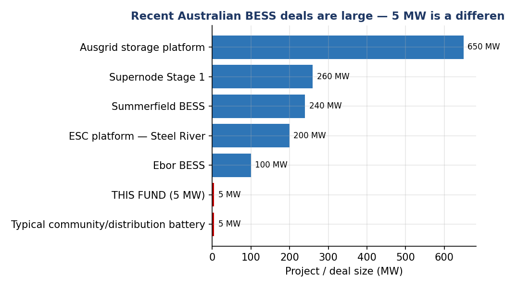
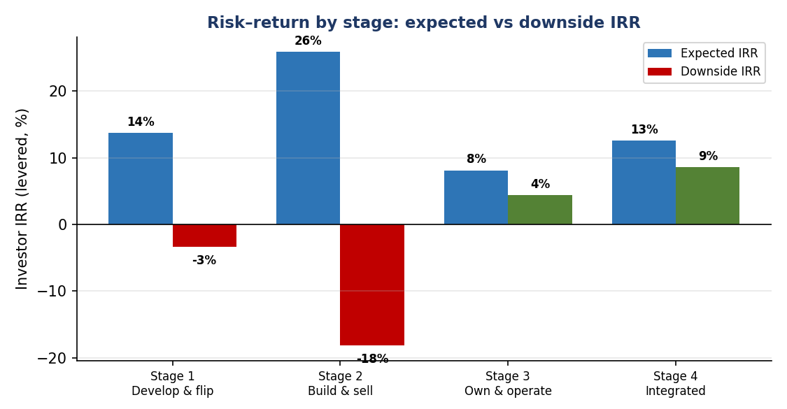

# Industry Analysis — Australian Distribution-Scale Battery "Develop-and-Flip"

### The market behind an illustrative develop-and-flip battery storage fund — an independent assessment

*This is the project's single industry write-up. It explains, in plain terms, the market the fund operates in and whether that market supports the fund's plan. It is an educational / due-diligence document, **not investment advice**. Every figure attributed to the fund manager is treated as a **claim to be checked**; our own findings come from free public data. All numbers reflect Australian conditions as at mid-2026 and should be re-verified before any decision. Acronyms are spelled out on first use; a full data-source-and-method table is at the end.*

---

## What the fund actually does

The fund does not build batteries and sell electricity. It buys small sites, takes them through planning approval and grid connection until they are "shovel-ready" — the industry term is **ready-to-build (RTB)** — and then sells the approved projects to someone else who builds them. Each project is a standalone battery of about **5 megawatts (MW)** connected to the local distribution network (the everyday poles-and-wires, not the high-voltage transmission grid), and the projects are spread across New South Wales, Victoria and South Australia. The whole cycle is meant to take two to three years.

This is the most important thing to understand, because it changes which risks matter. A normal battery owner lives or dies on the volatile price of electricity over fifteen or twenty years. This fund is gone before the battery ever switches on, so **that price risk belongs to the buyer, not to the fund.** Its two real questions are therefore simpler and sharper: **can the fund get its projects approved and connected on time, and will there be buyers willing to pay the assumed prices when it comes time to sell?**

## What the stations are for, who uses them, and how big the market is

**What a 5 MW battery does.** A 5 MW distribution-connected battery is, in practice, a **community / neighbourhood battery** — these connect to the local network and are typically up to 5 MW. Its jobs, and who benefits, are:

| What it does | Who uses / benefits |
|---|---|
| Stores the midday rooftop-solar surplus and releases it into the evening peak | Households & local community |
| Supports the local network (voltage, reliability) and defers poles-and-wires upgrades | Distribution network service provider (DNSP) — the local network company |
| Buys power cheap / sells dear (energy arbitrage) and provides fast frequency control ancillary services (FCAS) | The wholesale market, via the Australian Energy Market Operator (AEMO) |
| Firms local solar and wind | Electricity retailers & community |

*Basis — Data source: distribution network service provider community-battery programmes (Ausgrid, Endeavour), Energy Networks Australia, the Australian Energy Regulator (AER), and the Australian Renewable Energy Agency (ARENA); stored in [`data/processed/end_use.csv`](data/processed/end_use.csv). Method: use-case mapping (each service matched to its user). Calculation: none — compiled from public programme descriptions.*

**Who owns them today — a telling fact.** Almost all existing community/distribution batteries are **owned and operated by the network companies (distribution network service providers)** or funded by **government programmes** — the federal $200 million Community Batteries programme, Victoria's 100 Neighbourhood Batteries programme, Power Melbourne, and network roll-outs (Ausgrid has commissioned a 5 MW community battery). Most still need a discounted network tariff to be financially viable.

**Is the market big?** Storage demand is large and growing fast — but the 5 MW niche is a *distinct, smaller slice* of it. Using the Australian Energy Market Operator's Integrated System Plan 2026 (its central "Step Change" scenario):

| Segment | 2026 | 2030 | 2050 |
|---|---|---|---|
| Small-scale / distributed (home + community batteries) | 5 gigawatts (GW) | 12 GW | 35 GW |
| Grid-scale (developer-built, ~100 MW and above) | ~45 GW already in the connection queue | — | ~40 GW of need |

So demand is real and structural — **but the capital and the deals sit overwhelmingly at the grid-scale (100 MW and above) end**, which leads straight to the buyer question below.

*Basis — Data source: Australian Energy Market Operator Integrated System Plan 2026, reported via pv magazine Australia, RenewEconomy and Energy-Storage.news; stored in [`data/processed/market_demand.csv`](data/processed/market_demand.csv). Method: reported public figures (market sizing). Calculation: read directly from the published Integrated System Plan trajectory; re-verify against the source document.*

## Is the market real and growing?

Yes, and for structural rather than fashionable reasons. Australia is closing its ageing coal power stations while adding large amounts of solar and wind. Because solar and wind are intermittent, the grid increasingly needs storage that can deliver power on demand, and batteries are the cheapest and fastest way to provide it for the short durations that matter most today. Governments have backed this with firm targets and subsidy schemes, which turns a physical need into real, financeable demand. Importantly, the amount of storage actually funded still lags well behind the targets, so there is genuine room for new projects.

For a developer who simply wants to build approved projects and sell them, this fast growth is helpful — rising demand means more potential buyers. (The same instability would worry someone planning to own and operate for fifteen years, but that is not this fund.) The one caveat is that the demand rests on government policy, and a two-to-three-year fund is exposed if those policies soften part-way through.

*Basis — Data source: Australian Energy Market Operator Integrated System Plan 2026; Clean Energy Finance Corporation and state-government renewable targets. Method: industry life-cycle model (Chartered Financial Analyst, or CFA, curriculum) — placing the industry on the embryonic → growth → mature → decline curve. Calculation: a qualitative classification ("growth") read from the storage-capacity growth trajectory.*

## Is the fund's niche defensible?

Plausibly, but it needs checking. The fund's edge is that it deliberately works on **small ~5 MW projects** that the big developers overlook in favour of large 100 MW-plus transmission projects, which leaves the small end of the market less crowded. There is also a regulatory advantage: projects under 5 MW are exempt from a layer of Australian Energy Market Operator registration, which should make approval faster and cheaper. If that exemption holds, and if the fund genuinely has the site access, grid know-how and network-operator relationships it claims, the niche could be defensible. None of that should be taken on trust — it is exactly what diligence must confirm.

*Basis — Data source: Australian Energy Regulator / Australian Energy Market Operator market rules (the sub-5 MW registration exemption); trade-press commentary on the small-distribution segment. Method: Porter's Five Forces (CFA curriculum / Michael Porter), applied to the market for development rights — specifically the "threat of new entrants" and "rivalry" forces. Calculation: none — a qualitative competitive assessment.*

## The decisive risk: will there be buyers?

This is the heart of the matter. Because the fund's entire return comes from selling, the strength of the buyer market decides everything. The good news is that the pool of buyers for Australian battery assets is real and well-funded:

- **Independent power producers**, building out their own portfolios
- **Infrastructure funds** — for example Palisade/Intera, Copenhagen Infrastructure Partners, Quinbrook
- **Superannuation funds** — for example Aware Super, the Health Employees Superannuation Trust Australia (HESTA)
- **Government green-investment bodies** — the Clean Energy Finance Corporation (CEFC) and the Energy Security Corporation (ESC)
- **Large electricity retailers** — for example Origin, AGL, EnergyAustralia

Two cautions dominate, though. First, the fund's "three interested buyers" are **not contractually committed** — interest is not a purchase. Second, and more important, the wider market increasingly pays up for projects that are *further along*, already contracted or construction-ready, whereas this fund sells at the *earlier* ready-to-build stage. So the fund must show either that demand for ready-to-build projects specifically is genuinely deep, or that its projects are de-risked enough to command the assumed prices.

**Do buyers actually want 5 MW assets — or do they prefer 100 MW and above?** This is the sharpest question, and the recent deal record answers it plainly: **the deep-pocketed buyers transact at scale, not at 5 MW.**

| Recent deal / project | Size | Buyer |
|---|---|---|
| Summerfield (South Australia) | 240 MW / 960 megawatt-hours (MWh) | Palisade (with the Clean Energy Finance Corporation, Aware Super, the Health Employees Superannuation Trust Australia) |
| Supernode Stage 1 (Queensland) | 260 MW / 619 MWh | Origin (12-year tolling contract) |
| Energy Security Corporation platform (New South Wales) | 200 MW | Energy Security Corporation |
| Ebor (New South Wales) | 100 MW / 870 MWh | New South Wales Long-Term Energy Service Agreement (LTESA) tender |
| **A community / distribution battery** | **~5 MW** | **Distribution network service provider / government programme / aggregator** |

Infrastructure and superannuation funds say it out loud — Aware Super and the Health Employees Superannuation Trust Australia described the 240 MW Summerfield deal as exactly the **"large scale"** infrastructure they want. A single 5 MW project is simply **too small** for them: the due-diligence and management effort is much the same as for a 200 MW asset, so they favour size. The natural buyers of *individual* 5 MW batteries are a **thinner, more specialised, often grant-dependent pool** — distribution network service providers, government programmes and aggregators.

**The mitigation — and the catch.** The way a small-project developer reaches the big buyers is to **bundle many projects into a portfolio.** The fund's ~35 projects (~175 MW combined) could, aggregated, reach the scale an infrastructure fund wants, and the market increasingly supports aggregation. But that changes the exit: the fund would likely have to **sell the whole portfolio as a single platform** — one large, all-or-nothing transaction — rather than sell 5 MW projects one at a time. That **concentrates** the exit risk rather than removing it, and it only works if the portfolio is deliberately built and marketed as one block.

*Basis — Data source: energy trade press (Energy-Storage.news, pv magazine Australia, power-technology, Quinbrook, Energy Security Corporation); stored in [`data/processed/deal_sizes.csv`](data/processed/deal_sizes.csv). Method: comparable-transactions analysis (CFA relative-valuation; mergers-and-acquisitions practice) — recent deals listed by size and buyer. Calculation: none — observed deal sizes; the chart simply plots reported megawatts per deal.*

## Can they execute? The success-rate question

The other make-or-break is whether projects actually clear their hurdles on schedule. We model success as a chain — a project must win planning approval, *then* secure grid connection, *then* find a buyer — and read each step from public data:

| Step | Chance of passing |
|---|---|
| Planning approval | ~80% |
| Grid connection | ~70% |
| Reach a sale | ~80% |
| **All three (multiplied)** | **~45%** |

In other words, only about **45%** of projects started are likely to make it the whole way. That 45% is the key finding, because the manager's base case assumes **65%**. In plain terms, the fund's central plan looks optimistic on the very variable that matters most, and our independent estimate sits closer to the manager's *conservative* case than its base case. There is a fair counter-argument — the sub-5 MW exemption and the simplicity of small projects might genuinely lift success above the benchmark — so the right response is not to dismiss the fund, but to **ask the manager for project-by-project, state-by-state evidence** of its approval and connection record. Timing is the other enemy: approvals routinely take many months, and if they slip by six to twelve months the returns fall sharply.

*Basis — Data source: public planning-approval and grid-connection data (Australian Energy Market Operator connection statistics; New South Wales / Victoria / South Australia planning portals); stored in [`data/processed/gate_stats.csv`](data/processed/gate_stats.csv). Method: a probability-of-default (PD) / survival curve — the same multi-period idea credit teams use under the Basel framework and International Financial Reporting Standard 9 (IFRS 9). Calculation: cumulative success = 0.80 × 0.70 × 0.80 = 0.448, i.e. ~45%.*

## What this means for the returns

(The full figures are in the valuation model; this is the bottom line.) When we rebuild the fund's returns independently — using our own, more cautious success rate and costs — the expected investor return after fees comes out around **13–14%**, below the roughly **18%** the manager's own scenarios imply. More tellingly, the downside is real: in the conservative case the fund can return **less than the money invested**. So the opportunity looks attractive on the manager's numbers and merely adequate on ours, with a genuine risk of loss if execution disappoints.

*Basis — Data source: the model's inputs in [`config/assumptions.yaml`](config/assumptions.yaml) plus the live risk-free rate from the Reserve Bank of Australia (RBA). Method: risk-adjusted net present value (rNPV) per project; a fund "funnel" (projects started = target ÷ success rate); fees and carried interest; then probability-weighting the scenarios with the First-Chicago method (CFA scenario analysis + private-equity/venture-capital practice). Calculation: each scenario's after-fee internal rate of return (IRR), weighted 30% / 50% / 20%, gives ≈ 13.7%; the conservative case returns a multiple on invested capital (MOIC) of 0.93× — below 1.0× — i.e. a capital loss.*

## Ways to invest along the value chain — and which stage to choose

The same projects can be entered at several points on the value chain. The first three are *standalone* entry points (you buy in at that stage's market price); the fourth is the **integrated** path, where you carry one project through all three. Each is a genuinely different investment on a risk ladder — **develop (highest risk) → build → operate (lowest, if contracted)** — compared here as risk-adjusted, levered equity returns on the same ~5 MW asset:

| Stage | Hold | Expected return | Downside | In plain terms |
|---|---|---|---|---|
| 1 — Develop & flip (sell ready-to-build) | ~3 yrs | ~14% | **can lose capital (−3%)** | capital-light, short, but binary |
| 2 — Build & sell | ~1.5 yrs | ~26% | **heavy loss (−18%)** | highest return, but most fragile |
| 3 — Own & operate (contracted) | ~15 yrs | ~8% | **still positive (+4%)** | steady, long, capital-preserving |
| 4 — Integrated (develop → build → operate) | ~18 yrs | ~13% | **positive (+9%) if it reaches operation** | the whole value chain, no exit risk; longest, all risks stacked |

**Which stage suits a patient, capital-preservation-minded investor:**

- **Stage 3 (own & operate, *contracted*) is the natural core.** It is the only *standalone* stage that stays positive in its downside — steady, long-dated, capital-preserving yield. It also plays to a credit-risk strength: judging whether the tolling/offtake buyer will actually pay is the same as judging whether a borrower can service a loan. Avoid uncontracted, merchant-only assets — that is just betting on electricity prices.
- **Stage 1 (develop & flip) is a smaller, higher-risk satellite** — only on the conditions below.
- **Stage 2 (build & sell) is best skipped on its own.** It shows the highest *expected* return, but it is the most fragile: the profit depends entirely on the finished asset being worth more than it costs to build — a thin, price-dependent margin — and the downside is a heavy loss. It also needs construction expertise.
- **Stage 4 (integrated: develop → build → operate) is a different business, not a passive investment.** It captures the entire value chain and **removes the buyer/exit risk** — because you keep the asset, the sale gate disappears, and even the low-merchant downside stays positive *if the project reaches operation*. The catch: it is the **longest lock-up (~18 years)**, it stacks development + construction + merchant risk, and only ~50% of started developments reach operation (development is cheap, so the failures cost little). It suits a patient owner-operator with development *and* operating capability — not an investor who needs liquidity.
- **One alignment warning:** the manager keeps "the best 5–10 projects to operate" (Stage 3) and sells the rest, so the flip fund may be left the weaker projects. If the operating economics appeal, ask to **co-invest in the projects they keep.**

> **Why the sale-gated 65% success rate is a Stage-1 number.** That rate is the chance a project clears planning approval, grid connection *and* a sale — so it includes the buyer/exit risk. A Stage 2 (build) or Stage 3 (operate) investor **buys a project that has already cleared development**, at its market price, so they bear construction completion (~90%) and merchant price respectively, not the development-success rate. The **integrated path (Stage 4) also runs the development gauntlet, but without the sale gate** — its development survival is planning × grid connection (≈56%), because it keeps the asset rather than selling it. Each stage is priced at its own entry point, which keeps the returns comparable like-for-like, and the manager's 65% drives only the Stage 1 result.

*Basis — Data source: model inputs in [`config/assumptions.yaml`](config/assumptions.yaml) (development cost, construction cost, operating revenue, debt terms), with the risk-free rate from the Reserve Bank of Australia. Method: levered equity internal rate of return for each stage — Stage 1 is the fund funnel; Stage 2 is a build-and-sell model risk-adjusted by completion probability; Stage 3 is a levered operating discounted-cash-flow with low/base/high merchant-price scenarios. Full workings, including the operating model, are in [`financial_models/STAGE_COMPARISON.md`](financial_models/STAGE_COMPARISON.md). The figures are illustrative; the Stage 2 result is very sensitive to the build margin.*

## The verdict

The market is real, growing, policy-supported and well-suited to a small, capital-light fund. The strategy is genuinely investable — **but only conditionally**, because two things the manager's projections cannot prove on their own decide the outcome: a deep and durable pool of buyers for ready-to-build projects, and a realistic success rate. We would not commit on the strength of the projections alone.

Before any commitment, the manager should be asked to provide:

- evidence of **real, recent sales** of comparable small ready-to-build projects at the assumed prices, and whether any of the "interested buyers" are contractually committed;
- its **approval and grid-connection success rates by state**, specifically for sub-5 MW projects, that would reconcile its 65% base case with our ~45% estimate;
- a **bottom-up build-up of the ~$500,000 development cost** per project;
- the **net-of-all-fees return**, and the gross return behind it;
- what happens to the timeline and returns **if approvals slip by six to twelve months**;
- how the projects it plans to **keep and operate (five to ten of the best)** are chosen, since that affects what is left for investors; and
- the genuine **worst case** — in which scenario could investors lose money?

The single biggest risk is the exit: a project with no buyer is stranded capital. Execution and approval risk come next, and the optimistic success rate compounds both. The thing that usually sinks battery investments — volatile electricity prices — is, for this fund, the buyer's problem rather than ours.

---

## How this assessment was done (methods)

This report uses standard **Chartered Financial Analyst (CFA) curriculum industry-analysis frameworks** alongside the way **private-equity and infrastructure investors screen real deals.** Each conclusion traces back to one of these methods:

| What we wanted to know | Method used | Where it comes from |
|---|---|---|
| What exactly are we analysing? | Define the industry narrowly *before* analysing it (here: small ~5 MW distribution ready-to-build projects) | CFA — Industry & Company Analysis |
| Is the industry growing or maturing? | The industry life-cycle model | CFA |
| How tough is the competition? | Porter's Five Forces — applied to the development-rights market, not electricity | CFA / Michael Porter (Harvard) |
| What outside forces help or hurt? | A "PESTLE" scan — Political, Economic, Social, Technological, Legal, Environmental | CFA |
| Is this a good *type* of deal? | The private-equity / venture-capital deal screen — exit path, barriers to entry, capital intensity | Real-world private-equity & infrastructure practice |
| Will a project actually succeed? | A survival / probability-of-default chain (multiply the chance of clearing each gate) | Credit-risk practice (Basel framework, International Financial Reporting Standard 9) |
| What return does it give? | Risk-adjusted net present value, three scenarios weighted (the First-Chicago method), internal rate of return and multiple on invested capital | CFA (time value of money, expected value) + private-equity/venture-capital practice |

### Where every figure comes from (data, method, calculation)

| Finding | Data source | Method / theory | How it is calculated |
|---|---|---|---|
| Industry stage = "growth" | Australian Energy Market Operator Integrated System Plan 2026 | Industry life-cycle model (CFA) | Qualitative reading of the storage-growth trajectory |
| Market size: small-scale 5 → 35 GW; grid-scale ~45 GW | Integrated System Plan 2026 via pv magazine / RenewEconomy / Energy-Storage.news (`market_demand.csv`) | Reported public market sizing | Read from the published Integrated System Plan |
| What 5 MW batteries do / who uses them | Distribution network service provider & government programmes; ARENA; AER (`end_use.csv`) | Use-case mapping | Compiled from public programme descriptions |
| Buyers transact at 100 MW+ | Energy trade press (`deal_sizes.csv`) | Comparable transactions (CFA relative valuation; mergers-and-acquisitions practice) | Observed recent deals by size & buyer |
| Ready-to-build price (NSW $0.9–1.1m, etc.) | Manager's assumed prices — a claim; independent comparables still required | Comparable transactions | $/MW × 5 MW per project |
| Cumulative success ≈ 45% | Public planning + grid-connection data (`gate_stats.csv`) | Probability-of-default / survival curve (Basel, IFRS 9) | 0.80 × 0.70 × 0.80 = 0.448 |
| Discount rate 18.8% | Reserve Bank of Australia 10-year Commonwealth Government Securities yield (live, `rates.csv`) + a development risk premium (judgement) | Build-up method: required return = risk-free rate + risk premium (CFA) | 4.8% + 14.0% = 18.8% |
| Expected investor return ≈ 13–14% | Model inputs (`config/assumptions.yaml`) | Risk-adjusted net present value + fund funnel + First-Chicago weighting | Per-scenario internal rate of return weighted 30/50/20 |
| Conservative case loses capital (−3.3%) | Same model, conservative scenario | Same | Multiple on invested capital 0.93× → negative internal rate of return |
| Stage returns 14% / 26% / 8% | Model (`config/assumptions.yaml`) | Levered equity internal rate of return; operating discounted-cash-flow; build-and-sell with completion risk | See [`financial_models/STAGE_COMPARISON.md`](financial_models/STAGE_COMPARISON.md) |

In every case the inputs come from **free public data**, and the manager's figures were **re-derived independently** rather than taken on trust. The full quantitative workings are in the valuation model ([`financial_models/`](financial_models/)) and the [README](README.md).

---

*Independent findings draw on free public data (Australian Energy Market Operator, the Commonwealth Scientific and Industrial Research Organisation's GenCost report, the Reserve Bank of Australia, and the New South Wales / Victoria / South Australia planning portals); see [`SOURCES.md`](SOURCES.md). The valuation rebuild that produces the return figures (a survival-curve / risk-adjusted model) lives in [`financial_models/`](financial_models/) and the [`notebooks/`](notebooks/). Manager figures are forward-looking claims and must be independently verified.*
